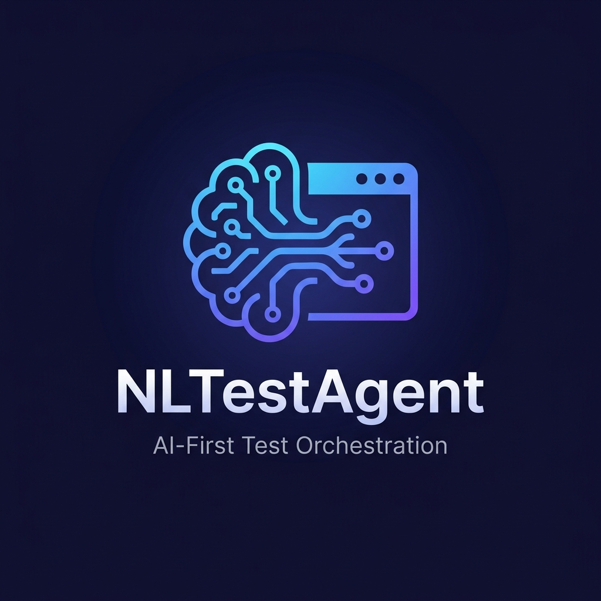

# NLTestAgent

<p align="center">
  
</p>

<p align="center"><strong>Test automation driven by natural language — not scripts.</strong></p>

[](https://www.typescriptlang.org/)
[](https://webdriver.io/)
[](https://aws.amazon.com/bedrock/)
[](https://opensource.org/licenses/ISC)

**NLTestAgent** is an AI-first end-to-end test orchestration framework that lets you describe test scenarios in plain English and automatically maps them to browser automation workflows — no scripting required.

Instead of maintaining brittle test scripts, you simply tell it what to validate:

```bash
npm run orchestrate -- "Validate flight search from Pune to Delhi"
npm run orchestrate -- "Validate hotel search in Mumbai"
```

The agent:
1. Parses your natural language intent via **AWS Bedrock (Claude 3.5 Sonnet)** to provide the correct execution path. *(Note: a local semantic fallback exists, but it is purely a bypass for local testing)*
2. Routes to the best-matching registered workflow
3. Executes full browser automation via **WebdriverIO** against live portals
4. Returns a structured `PASSED` / `FAILED` report with per-step detail and an auto-captured failure screenshot

Built as a proof-of-concept targeting the **EaseMyTrip** travel portal, with an extensible architecture for any web portal.

---

## Table of Contents

1. [Overview](#overview)
2. [Architecture](#architecture)
3. [Project Structure](#project-structure)
4. [Technology Stack](#technology-stack)
5. [Core Concepts](#core-concepts)
   - [Semantic Orchestration Layer](#semantic-orchestration-layer)
   - [Page Object Model (POM)](#page-object-model-pom)
   - [DSL Workflow Layer](#dsl-workflow-layer)
   - [Workflow Registry](#workflow-registry)
6. [Implemented Workflows](#implemented-workflows)
7. [Setup & Installation](#setup--installation)
8. [Configuration](#configuration)
9. [Running Tests](#running-tests)
10. [Adding New Workflows](#adding-new-workflows)
11. [DOM Quirks & Anti-Automation Mitigations](#dom-quirks--anti-automation-mitigations)
12. [Failure Handling](#failure-handling)
13. [Known Limitations & Roadmap](#known-limitations--roadmap)

---

## Overview

**NLTestAgent** bridges natural language and browser automation. You write a human sentence; the agent figures out which test to run, executes it end-to-end in a real Chrome browser, and hands back a clear pass/fail report.

The key insight: **test intent should be expressed as requirements, not code**. When the site changes (selectors shift, URLs change), only the Page Object needs updating — the natural language interface stays the same.

### How it works

| Step | What happens |
|---|---|
| 1. **Prompt** | You type a plain-English test description |
| 2. **Route** | AWS Bedrock (Claude 3.5 Sonnet) analyzes intent and maps it to a workflow |
| 3. **Execute** | A DSL flow drives a real Chrome browser via WebdriverIO POMs |
| 4. **Report** | A structured PASSED/FAILED result with step details and screenshot on failure |

---

## Data Flow

```text
┌─────────────────────────────────────────────────────────────┐
│ 1. User Input (CLI / HTTP API)                              │
│    e.g., "Validate flight search from Pune to Delhi"        │
└──────────────┬──────────────────────────────────────────────┘
               │
               ▼
┌─────────────────────────────────────────────────────────────┐
│ 2. Orchestration Hub (run.ts)                               │
└──────────────┬──────────────────────────────────────────────┘
               │ Passes natural language prompt
               ▼
┌─────────────────────────────────────────────────────────────┐
│ 3. Workflow Selector (AI Layer)                             │
│    Builds structured prompt with available workflows.       │
└──────────────┬──────────────────────┬───────────────────────┘
               │                      │ BYPASS_BEDROCK=true
               │ [The Real Flow]      │ [Local Bypass Flow]
               ▼                      ▼
┌─────────────────────────┐   ┌───────────────────────────────┐
│ 4a. AWS Bedrock         │   │ 4b. localSemanticFallback()   │
│     (Claude 3.5 Sonnet) │   │     (Basic Keyword Matcher)   │
└──────────────┬──────────┘   └───────┬───────────────────────┘
               │                      │
               ▼                      ▼
┌─────────────────────────────────────────────────────────────┐
│ 5. Returns matched workflow name (e.g., validateFlightSearch)
└──────────────┬──────────────────────────────────────────────┘
               │ Look up function in Registry
               ▼
┌─────────────────────────────────────────────────────────────┐
│ 6. Workflow Executor                                        │
│    Invokes the matched DSL function                         │
└──────────────┬──────────────────────────────────────────────┘
               │ Execute
               ▼
┌─────────────────────────────────────────────────────────────┐
│ 7. Domain Specific Language (DSL) Layer                     │
│    (flightSearchFlow.ts / hotelSearchFlow.ts)               │
└──────────────┬──────────────────────────────────────────────┘
               │ Orchestrates Page actions
               ▼
┌─────────────────────────────────────────────────────────────┐
│ 8. Page Object Models (POMs)                                │
│    Encapsulates DOM selectors and wait logic                │
│    (EaseMyTripHomePage, FlightResultsPage, etc.)            │
└──────────────┬──────────────────────────────────────────────┘
               │ Drives Browser via JSON Wire Protocol
               ▼
┌─────────────────────────────────────────────────────────────┐
│ 9. WebdriverIO & Real Browser                               │
│    Executes clicks, typing, and captures screenshots        │
└──────────────┬──────────────────────────────────────────────┘
               │ Returns execution success/failure state
               ▼
┌─────────────────────────────────────────────────────────────┐
│ 10. Report Generator                                        │
│     Outputs PASSED/FAILED summary and step details          │
└─────────────────────────────────────────────────────────────┘
```

---

## Project Structure

```
wdio-agent/
├── src/
│   ├── ai/                         # AI / LLM integration layer
│   │   ├── bedrockClient.ts        # AWS Bedrock (Claude) API wrapper
│   │   ├── promptBuilder.ts        # Prompt construction for workflow selection
│   │   └── workflowSelector.ts     # NL → workflow routing (AI + local fallback)
│   │
│   ├── dsl/                        # Domain-Specific Language: workflow execution units
│   │   ├── flightSearchFlow.ts     # End-to-end flight search automation
│   │   └── hotelSearchFlow.ts      # End-to-end hotel search automation
│   │
│   ├── pages/                      # Page Object Models (POM)
│   │   ├── BasePage.ts             # Abstract base: navigation, chatbot dismiss, utils
│   │   ├── EaseMyTripHomePage.ts   # Home page: origin, destination, date, search
│   │   ├── FlightResultsPage.ts    # Results page: URL/DOM validation, card count
│   │   ├── EaseMyTripHotelsPage.ts # Hotels page: city, check-in/out, search
│   │   └── flightPage.ts           # [Legacy] pre-POM flight page reference
│   │
│   ├── registry/
│   │   └── workflowRegistry.ts     # Registry map of all named workflows
│   │
│   ├── executor/
│   │   └── workflowExecutor.ts     # Dispatches workflow by name from registry
│   │
│   ├── reports/
│   │   └── reportGenerator.ts      # Formats WorkflowResult into human-readable string
│   │
│   ├── api/                        # HTTP API handlers (Express)
│   ├── cli.ts                      # CLI entry point
│   ├── run.ts                      # Core orchestration function (shared by CLI + API)
│   ├── server.ts                   # Express HTTP server
│   ├── app.ts                      # Express app definition
│   ├── debug-calendar.ts           # [Dev] DOM inspector for calendar elements
│   └── debug-selector.ts           # [Dev] Selector exploration utility
│
├── screenshots/                    # Auto-captured failure screenshots
├── dist/                           # Compiled JS output (tsc)
├── .env                            # Environment configuration (do not commit)
├── package.json
└── tsconfig.json
```

---

## Technology Stack

| Layer | Technology | Version | Purpose |
|---|---|---|---|
| Language | TypeScript | 5.4.x | Type safety across all layers |
| Browser Automation | WebdriverIO | 8.36.x | Cross-browser E2E test execution |
| Browser | Google Chrome | 148.x | Target browser (local) |
| AI / LLM | AWS Bedrock (Claude 3.5 Sonnet) | `@aws-sdk/client-bedrock-runtime` | Natural language → workflow routing |
| HTTP Server | Express | 4.19.x | REST API interface |
| Runtime | ts-node | 10.9.x | Direct TS execution (dev mode) |

---

## Core Concepts

### Semantic Orchestration Layer

**Files:** `src/ai/workflowSelector.ts`, `src/ai/bedrockClient.ts`, `src/ai/promptBuilder.ts`

This is the intelligence layer. Given a natural language string, it determines which registered workflow should be executed.

**With Bedrock enabled (`BYPASS_BEDROCK=false`) — The Real Flow:**
- Builds a structured prompt listing all registered workflows and their descriptions
- Sends it to Claude 3.5 Sonnet via AWS Bedrock (`ConverseCommand`)
- Bedrock analyzes the natural language intent and provides the correct workflow path
- Parses the JSON response to extract the selected workflow name
- Handles Markdown-wrapped JSON (`\`\`\`json ... \`\`\``) gracefully

**Local semantic fallback (`BYPASS_BEDROCK=true`) — The Bypass Flow:**
- *This is just a bypass/mock mechanism for local testing without AWS credentials.*
- Uses simple keyword-based routing (no API call)
- Matches tokens like `flight`, `fly`, `pune`, `delhi` → `validateFlightSearchFlow`
- Matches `hotel`, `stay`, `room`, `mumbai` → `validateHotelSearchFlow`

```typescript
// Example: How the AI selects workflows
const workflow = await selectWorkflow("Validate flight search from Pune to Delhi");
// → Returns: { name: "validateFlightSearchFlow", execute: fn }
```

---

### Page Object Model (POM)

**Files:** `src/pages/`

All page interactions are encapsulated in typed POM classes that extend `BasePage`. This provides:
- **Selector isolation** — DOM selectors are defined once as getters, never scattered across test code
- **Reusability** — DSL flows compose POM methods without knowing selector details
- **Resilience** — Multi-strategy selectors handle EaseMyTrip's dynamic DOM

#### `BasePage` (abstract)

Shared utilities inherited by all POMs:

| Method | Description |
|---|---|
| `navigate(url)` | URL navigation, swallows timeout errors (site is slow) |
| `dismissChatbot()` | Dismisses the EVA chatbot overlay using multiple selector strategies |
| `safeClick(selector)` | Wait-for-clickable then click |
| `findFirstVisible(selectors[])` | Returns first existing + displayed element from a list |
| `pressEscape()` | Keyboard escape to dismiss any modal |

#### `EaseMyTripHomePage`

The most complex POM — handles EaseMyTrip's heavily dynamic flight search form.

| Method | Description |
|---|---|
| `open()` | Navigate to `easemytrip.com`, wait, dismiss chatbot |
| `ensureFlightsTabSelected()` | Click the Flights tab if present |
| `selectOrigin(city)` | 3-strategy autocomplete: XPath text → container CSS → JS click |
| `selectDestination(city)` | Same 3 strategies + Top Cities shortcut (auto-opens after origin) |
| `selectTravelDate(daysFromToday)` | Opens `#dvcalendar`, clicks `<li id="trd_{wday}_{DD/MM/YYYY}">` |
| `clickSearch()` | Normal click with JS fallback (overlay-safe) |

> **Key DOM insight:** EaseMyTrip's fare calendar uses **`<li>` elements** with IDs like `trd_2_16/06/2026`, not `<td>`. The calendar is rendered inside `#dvcalendar` and auto-opens after destination selection. See [DOM Quirks](#dom-quirks--anti-automation-mitigations).

#### `FlightResultsPage`

| Method | Description |
|---|---|
| `waitForResultsLoaded()` | Polls URL (`/flight-search/`, `/flightlist/`) + DOM container for up to 15s |
| `getFlightCount()` | Returns count of visible flight result cards |
| `getCurrentUrl()` | Returns current browser URL |

#### `EaseMyTripHotelsPage`

| Method | Description |
|---|---|
| `open()` | Navigate to `easemytrip.com/hotels/` |
| `selectCity(city)` | Autocomplete city selection (3-strategy) |
| `selectCheckInDate(days)` | jQuery UI datepicker day click |
| `selectCheckOutDate(days)` | jQuery UI datepicker day click |
| `clickSearch()` | Hotel search submission |

---

### DSL Workflow Layer

**Files:** `src/dsl/`

DSL flows are the executable test units. Each flow:
1. **Owns its browser session** — creates and destroys `remote()` independently
2. **Composes POM methods** — no raw selectors, only POM calls
3. **Tracks steps** — maintains a `stepsReport[]` array for granular pass/fail reporting
4. **Captures failure screenshots** — saved to `screenshots/failure-{type}-{timestamp}.png`
5. **Returns `WorkflowResult`** — structured result consumed by the report generator

```typescript
export interface WorkflowResult {
  status: "PASSED" | "FAILED";
  summary: string;
  details?: {
    steps: Array<{ name: string; status: "PASSED" | "FAILED"; error?: string }>;
    screenshotPath?: string;
  };
}
```

**Chrome launch flags used in all DSL flows:**

| Flag | Reason |
|---|---|
| `--disable-blink-features=AutomationControlled` | Prevents bot detection |
| `excludeSwitches: ["enable-automation"]` | Removes "Chrome is being controlled" banner |
| `--disable-notifications` | Stops chatbot/push notification popups |
| `--disable-gpu`, `--no-sandbox` | Stability on macOS/CI |
| `--disable-http2`, `--ignore-certificate-errors` | Handles EaseMyTrip's TLS quirks |
| `pageLoadStrategy: "eager"` | Don't wait for all resources; proceed when DOM is interactive |

---

### Workflow Registry

**File:** `src/registry/workflowRegistry.ts`

Central map of all available workflows. Adding a new workflow = adding one entry here.

```typescript
export const workflowRegistry: Record<string, Workflow> = {
  validateFlightSearchFlow: {
    name: "validateFlightSearchFlow",
    description: "Validate EaseMyTrip flight search functionality.",
    execute: validateFlightSearchFlow,
  },
  validateHotelSearchFlow: {
    name: "validateHotelSearchFlow",
    description: "Validate EaseMyTrip hotel search functionality.",
    execute: validateHotelSearchFlow,
  },
};
```

The `description` field is sent to Claude so it can intelligently route unknown prompts.

---

## Implemented Workflows

### `validateFlightSearchFlow`

**Trigger keywords:** `flight`, `fly`, `pune`, `delhi`

| Step | Action | POM Method |
|---|---|---|
| 1 | Open EaseMyTrip home | `homePage.open()` |
| 2 | Select origin city (Pune) | `homePage.selectOrigin("Pune")` |
| 3 | Select destination city (Delhi) | `homePage.selectDestination("Delhi")` |
| 4 | Select travel date (+10 days) | `homePage.selectTravelDate(10)` |
| 5 | Click Search | `homePage.clickSearch()` |
| 6 | Validate results page | `resultsPage.waitForResultsLoaded()` |

**Expected URL on success:**
```
https://www.easemytrip.com/flight-search/listing?srch=PNQ-Pune-India|DEL-Delhi-India|16/06/2026...
```

---

### `validateHotelSearchFlow`

**Trigger keywords:** `hotel`, `stay`, `room`, `mumbai`, `resort`

| Step | Action | POM Method |
|---|---|---|
| 1 | Open EaseMyTrip Hotels page | `hotelsPage.open()` |
| 2 | Select city (Mumbai) | `hotelsPage.selectCity("Mumbai")` |
| 3 | Select check-in date (+5 days) | `hotelsPage.selectCheckInDate(5)` |
| 4 | Select check-out date (+7 days) | `hotelsPage.selectCheckOutDate(7)` |
| 5 | Click Search | `hotelsPage.clickSearch()` |
| 6 | Validate results page | URL + DOM check |

---

## Setup & Installation

### Prerequisites

| Requirement | Version |
|---|---|
| Node.js | 18.x or 20.x (LTS) |
| npm | 9.x or 10.x |
| Google Chrome | Latest stable |
| ChromeDriver | Auto-managed by WebdriverIO |
| macOS | 12+ (Monterey or later) |
| AWS Account | Required only if using Bedrock AI routing |

### Install

```bash
git clone <repo-url>
cd wdio-agent
npm install
```

### Build (optional — for production)

```bash
npm run build
# Outputs compiled JS to ./dist/
```

---

## Configuration

Create or edit `.env` in the project root:

```env
# ── AWS Bedrock (required only if BYPASS_BEDROCK=false) ────────────────────────
AWS_REGION=us-east-1
AWS_ACCESS_KEY_ID=your_access_key_id
AWS_SECRET_ACCESS_KEY=your_secret_access_key

# Bedrock model ID
# Claude 3.5 Sonnet (recommended):
BEDROCK_MODEL_ID=anthropic.claude-3-5-sonnet-20240620-v1:0

# ── Orchestration Mode ─────────────────────────────────────────────────────────
# Set to "true" to skip Bedrock API calls and use fast local keyword routing.
# Recommended for local development and CI pipelines without AWS access.
BYPASS_BEDROCK=true

# ── HTTP API Server ────────────────────────────────────────────────────────────
PORT=3000
```

### Chrome Binary Path

The Chrome binary path is currently hardcoded in the DSL flows:

```typescript
binary: "/Applications/Google Chrome.app/Contents/MacOS/Google Chrome"
```

If your Chrome is installed elsewhere (e.g., Linux CI), update this in:
- `src/dsl/flightSearchFlow.ts`
- `src/dsl/hotelSearchFlow.ts`

> **Roadmap item:** Move Chrome binary path to `.env` as `CHROME_BINARY`.

---

## Running Tests

### Via CLI (primary interface)

```bash
# Flight search validation
npm run orchestrate -- "Validate flight search from Pune to Delhi"

# Hotel search validation
npm run orchestrate -- "Validate hotel search in Mumbai"

# Any natural language prompt (AI routes to the best matching workflow)
npm run orchestrate -- "Search for flights"
npm run orchestrate -- "Check if hotel booking works"
```

**Example output:**
```
==================================================
Starting Semantic Test Orchestration CLI...
Prompt: "Validate flight search from Pune to Delhi"
==================================================
[LOG] Workflow selected: validateFlightSearchFlow
[EaseMyTripHomePage] origin selected via XPath: //li[contains(normalize-space(.), 'Pune')]
[EaseMyTripHomePage] Destination selected via Top Cities shortcut
[EaseMyTripHomePage] ✅ Date clicked via XPath LI
[FlightResultsPage] Results page loaded. URL: https://www.easemytrip.com/flight-search/listing?...
==================================================
Status Outcome: PASSED
==================================================
```

### Via HTTP API

```bash
# Start the server
npm run dev       # development (ts-node)
npm start         # production (compiled dist/)

# Invoke via HTTP
curl -X POST http://localhost:3000/orchestrate \
  -H "Content-Type: application/json" \
  -d '{"prompt": "Validate flight search from Pune to Delhi"}'
```

### Development (direct TypeScript execution)

```bash
# Run any .ts file directly
npx ts-node src/debug-calendar.ts
npx ts-node src/debug-selector.ts
```

---

## Adding New Workflows

Adding a new workflow requires changes in **3 files only**:

### Step 1 — Create the DSL flow

```typescript
// src/dsl/trainSearchFlow.ts
import { remote } from "webdriverio";
import { WorkflowResult } from "./flightSearchFlow";
import { EaseMyTripHomePage } from "../pages/EaseMyTripHomePage";

export async function validateTrainSearchFlow(): Promise<WorkflowResult> {
  const browser = await remote({ /* ... same Chrome config ... */ });
  try {
    // compose POM methods here
    return { status: "PASSED", summary: "Train search validated." };
  } catch (error: any) {
    return { status: "FAILED", summary: error.message };
  } finally {
    await browser.deleteSession();
  }
}
```

### Step 2 — Register it

```typescript
// src/registry/workflowRegistry.ts
import { validateTrainSearchFlow } from "../dsl/trainSearchFlow";

export const workflowRegistry = {
  // ...existing workflows...
  validateTrainSearchFlow: {
    name: "validateTrainSearchFlow",
    description: "Validate EaseMyTrip train search functionality.",
    execute: validateTrainSearchFlow,
  },
};
```

### Step 3 — Add local keyword fallback

```typescript
// src/ai/workflowSelector.ts — localSemanticFallback()
if (reqLower.includes("train") || reqLower.includes("rail")) {
  return getWorkflow("validateTrainSearchFlow")!;
}
```

That's it. The CLI, HTTP API, and Bedrock routing all work automatically.

---

## DOM Quirks & Anti-Automation Mitigations

EaseMyTrip implements several patterns that complicate standard automation. Here are the known issues and how they are resolved:

### 1. Calendar uses `<li>` not `<td>`

**Problem:** EaseMyTrip's fare calendar renders day cells as `<li>` elements inside `#dvcalendar`, not as standard `<table><tr><td>`. Standard datepicker selectors (`a.ui-state-default`, `td`) all return empty.

**Solution:** Target elements by their ID pattern `trd_{weekday}_{DD/MM/YYYY}`:
```typescript
// Example: June 16, 2026 — try all 7 weekday IDs
const liId = `#trd_2_16/06/2026`;
```
`/` characters in dates make CSS IDs invalid, so XPath fallback is used:
```typescript
`//li[contains(@id, '16/06/2026')]`
```

**Discovered via:** `src/debug-calendar.ts` — a DOM inspection utility that dumps element types, IDs, and text content when the calendar is open.

---

### 2. Calendar auto-opens after destination selection

**Problem:** After selecting the destination city, EaseMyTrip automatically opens the fare calendar. Any attempt to click `#ddate` at this point fails with "element click intercepted" (the calendar overlay `#overlaybg1` blocks it).

**Solution:** Check `#dvcalendar.isDisplayed()` before attempting to open it. If already visible, skip the trigger click entirely.

---

### 3. `querySelectorAll("td")` returns `[]` even when calendar is visible

**Problem:** The calendar is rendered asynchronously after a JS animation/transition. `browser.execute(() => document.querySelectorAll("td"))` is called before the DOM has been mutated, returning an empty NodeList.

**Solution:** Use WebdriverIO's native `waitUntil()` + `browser.$$()` which polls the live WebDriver DOM state rather than evaluating a snapshot.

---

### 4. TO dropdown auto-opens after FROM selection

**Problem:** Selecting the origin city triggers EaseMyTrip to auto-open the destination (TO) dropdown, pre-populated with "Top Cities" (Delhi, Mumbai, etc.). Clicking the TO trigger when the dropdown is already open can cause it to close.

**Solution:** Check for visible "Top Cities" `<li>` items before triggering the TO input. Click the shortcut if found; otherwise fall through to the normal type-and-select flow.

---

### 5. Bot detection

**Problem:** EaseMyTrip checks for `navigator.webdriver`, `window.chrome.runtime`, and the "Chrome is controlled by automation software" banner.

**Solution:** Chrome is launched with:
- `--disable-blink-features=AutomationControlled`
- `excludeSwitches: ["enable-automation"]`

These flags suppress the WebDriver flag and automation banner, preventing the detection heuristics from triggering rate limiting or CAPTCHAs.

---

### 6. EVA Chatbot overlay

**Problem:** EaseMyTrip's AI chatbot "EVA" renders as a floating overlay that can intercept clicks on interactive elements below it.

**Solution:** `BasePage.dismissChatbot()` tries 7 different close selectors (`#imgCro`, `.close-btn`, `#close-eva`, etc.) immediately after page load.

---

## Failure Handling

Every DSL flow follows a consistent failure contract:

```
Step fails → catch(error)
    │
    ├── addStep(name, "FAILED", error.message)
    ├── saveScreenshot → screenshots/failure-{type}-{timestamp}.png
    └── return WorkflowResult { status: "FAILED", summary, details }
```

- **Screenshots** are saved unconditionally on any exception, providing visual evidence of the page state at the point of failure.
- **Step granularity** — each step is individually tracked, so partial failures show exactly which step broke.
- **CLI exit codes** — `process.exit(1)` on FAILED, `process.exit(0)` on PASSED, enabling CI/CD pipeline integration.

---

## Known Limitations & Roadmap

### Current Limitations

| Area | Limitation |
|---|---|
| **Chrome binary** | Hardcoded macOS path — not portable to Linux/Windows CI |
| **Targets** | Only EaseMyTrip — no multi-portal support |
| **Workflows** | Only flight and hotel search; no booking/payment flows |
| **Data-driven** | City names and date offsets are hardcoded in DSL flows |
| **Hotels calendar** | Uses legacy jQuery UI selectors — may break if EaseMyTrip updates |
| **Parallelism** | Single browser session per workflow — no parallel execution |
| **Reporting** | Console + screenshot only — no HTML/Allure/JUnit report |

### Roadmap

- [ ] Externalize Chrome binary path to `.env`
- [ ] Parameterize city names and date offsets via CLI arguments
- [ ] Allure / HTML report generation
- [ ] GitHub Actions CI workflow
- [ ] Docker container for headless execution
- [ ] Parallel workflow execution via worker threads
- [ ] MakeMyTrip portal support (see `src/inspectExpedia.ts`)
- [ ] Hotels calendar fix using `#dvcalendar` pattern (same as flights)
- [ ] Retry logic for flaky steps (network latency on EaseMyTrip)
- [ ] Configurable `WDIO_LOG_LEVEL` env var

---

## Developer Utilities

| File | Purpose |
|---|---|
| `src/debug-calendar.ts` | Opens EaseMyTrip, selects Pune → Delhi, then dumps full DOM info for the calendar: iframes, element types, IDs, class names, text content. Use to diagnose calendar selector issues. |
| `src/debug-selector.ts` | Interactive selector exploration utility for any EaseMyTrip page element |
| `src/inspectExpedia.ts` | Early-stage DOM inspector for MakeMyTrip (planned expansion target) |

Run them directly:
```bash
npx ts-node src/debug-calendar.ts
```

---

## License

ISC

---

*NLTestAgent — AI-first test orchestration | Last updated: June 2026*
